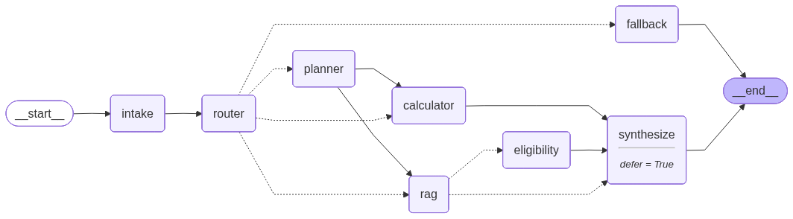
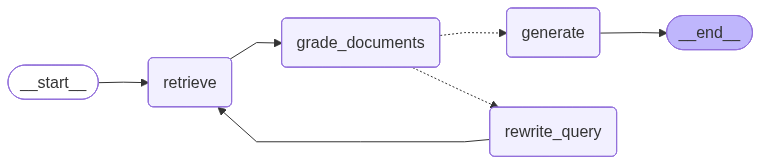

# Agentic RAG — EU Air Passenger Rights ✈️⚖️

A chatbot that tells you what you're owed when a flight is delayed, cancelled, or overbooked inside the
EU — and exactly how much, with the law to back it up. Under the hood it's a small **LangGraph
agentic-RAG workflow**: a local LLM that *looks the rules up* by grounded retrieval and *works the amount
out* with a deterministic calculator, guessing neither. And it stays simple to run — entirely on your own
machine, no paid APIs, nothing leaving the box, up with one command (`docker compose up`).

> ⚖️ **Not legal advice.** Answers interpret Regulation (EC) No 261/2004 for general information only.

> **◆ Decision —** *Why this problem — EU flight-disruption compensation.* A real, everyday entitlement
> that almost nobody claims, because the rules are fiddly and airlines are in no hurry to volunteer them.
> The need is concrete and bounded: "tell me, in plain terms, what I'm owed and why."
>
> **Trade-off —** a narrow, well-defined domain instead of a broad travel assistant — which keeps the
> corpus small and every answer checkable, at the cost of generality.

> **◆ Decision —** *Why agentic RAG with a deterministic tool.* The question is half law, half
> arithmetic: rights need grounded, citable retrieval, while the amount needs exact code rather than a
> model's guess. A small agentic graph routes between the two, decomposes the "both" case, and grounds
> the eligibility call in the regulation.
>
> **Trade-off —** more moving parts than a single chat prompt, bought as answers that are auditable
> (every right cites the law) and exact (every euro comes from code).

---

## Description of the problem and the objective

With that need established, the scope is narrow and deliberate. The system covers exactly one law —
**Regulation (EC) No 261/2004**, the EU's rules on flight disruption — and is not a general travel
assistant. That regulation governs three events:

- **denied boarding**
- **delayed flight**
- **cancelled flight**

For each, it grants the same remedies:

- **care**
- **re-routing**
- **refund**
- **cash compensation**

Everything else about flying is out of scope — the system has to recognise that and decline rather than
guess:

- baggage fees
- seat pricing
- pets in the cabin
- visas

The objective, then, is to answer the real-life questions people actually ask about this — which don't
all want the same thing:

- *"Can I get a refund if my flight is cancelled?"*
- *"My flight is delayed by 5 hours — am I entitled to meals and a hotel?"*
- *"What are my rights if I'm denied boarding because the flight was overbooked?"*
- *"My Budapest (BUD) → London (LHR) flight was delayed 4 hours. How much compensation am I owed?"*
- *"My Madrid → New York flight was cancelled by a snowstorm — what am I owed?"*
- *"Am I covered flying from New York to Paris on a US airline?"*
- *"Can I bring my dog in the cabin?"*

Step back from these examples and a general insight emerges: this need is a poor fit for a plain chatbot,
for four reasons:

- **Grounded in the law.** Answers about your rights come from the actual regulation, with a citation —
  not the model's memory, which you can't audit.
- **Exact by construction.** The compensation amount is arithmetic, and a small model will sometimes
  invent it, so it comes from real code rather than the model.
- **Not one-size-fits-all.** The questions don't all want the same thing — rights, an amount, both, or
  nothing in scope — so one path can't serve them.
- **Knows its lane.** Many questions fall outside this regulation; the system should recognise those and
  decline rather than guess.

Put together, those four needs point to four pieces:

- **RAG** to stay grounded in the law
- **calculator tool** to get the number right deterministically
- **conditional routing** to send each question down the right path
- **out-of-scope firewall** to decline what isn't covered

The routing comes first — it sorts every question into one of four kinds, each handled a different way:

- **"What are my rights?"** → a plain-language answer grounded in the law, with a citation. If the law
  doesn't support an answer, it says so rather than bluff.
- **"How much am I owed?"** → a figure the calculator works out from the flight's route (origin and
  destination), the delay, the disruption type, and whether re-routing was offered — then checked
  against eligibility.
- **"What am I owed *and* why?"** → a single answer that carries the grounded legal explanation
  and the computed amount together.
- **"Off-topic"** → a polite "that's outside what I cover," never a made-up rule.

The third case — **"What am I owed *and* why?"** — needs more than a single lane: it breaks into two
subtasks, looking up the rights and computing the amount, that can run independently and then be combined.
That's subtask decomposition and independent execution, again surfacing straight from the domain.

Taken together, these domain insights define the architecture that follows — each one becomes a concrete
piece of the design:

> **◆ Decision —** *Four question types → explicit conditional routing.* An intake step classifies each
> question into one of the four lanes and a router sends it down the matching path — autonomous
> decision-making over a fixed, predictable set of routes.
>
> **Trade-off —** routing can misread a borderline question, but the lanes overlap enough that the answer
> stays correct, and a fixed route set is far easier to test than free-form tool choice.

> **◆ Decision —** *The off-topic lane is a hard firewall, not a best-effort answer.* A question outside
> Reg. 261/2004 routes to a dedicated fallback that declines — it never improvises a rule or an amount.
>
> **Trade-off —** the system says "I can't help with that" more often than a general chatbot would, in
> exchange for never fabricating law or numbers outside its competence.

> **◆ Decision —** *The "how much?" half → a deterministic, non-retrieval tool.* The amount is pure
> arithmetic over the law's distance bands and thresholds, so it lives in a model-free calculator — the
> second tool alongside retrieval, and the one that isn't retrieval.
>
> **Trade-off —** the calculator must be fed clean inputs (airports, delay), but in return the figure
> can't drift and doubles as the eval's ground truth.

> **◆ Decision —** *Rights and eligibility → a modular RAG subgraph.* Both "what are my rights?" and the
> "is this even compensable?" judgement need grounded, citable law, so retrieval is a dedicated
> corrective-RAG subgraph callable from the main graph (and not counted among its nodes).
>
> **Trade-off —** a subgraph boundary to maintain, bought as grounding that flows through one reusable,
> independently testable place.

> **◆ Decision —** *The "both" question → decomposition into independent subtasks.* A mixed question fans
> out into a rights/eligibility branch and a calculator branch that run independently and converge once —
> decomposition and independent execution made literal.
>
> **Trade-off —** the fan-out/fan-in wiring is more intricate than a sequential path, bought as genuine
> parallel decomposition rather than an asserted one.

> **◆ Decision —** *Intermediate results live in one typed, shared state.* Extracted flight details, the
> routing decision, retrieved chunks, the eligibility verdict, the computed amount — each node reads from
> and writes to a single typed `AgentState` instead of passing arguments node to node.
>
> **Trade-off —** one schema to keep coherent across every node, bought as an inspectable record of how
> far each query got — including the append-only trace the UI streams step by step.

---

## Description of the data sources and corpus processing

Everything here answers questions about **Reg. 261/2004**, so the corpus is built *around the regulation
as the core*, with a few supporting documents that make that core more usable. There are two distinct bodies of
data, kept deliberately separate:

- **RAG corpus** — retrieved and cited as law
- **airport reference data** — used only by the calculator, which needs airport coordinates to compute
  the travel distance the compensation band depends on

### RAG corpus

A **frozen, dated snapshot** committed under `data/corpus/` — the single source of truth. The ChromaDB
index is a **derived artifact** (gitignored), rebuilt from the corpus by an **idempotent**
`python -m src.ingest`, so a fresh clone reproduces the *identical* index offline with no network access.
Four documents, each playing a distinct role *relative to the core law*:

| Document | Role relative to the core | Source |
|----------|---------------------------|--------|
| **Regulation (EC) No 261/2004** — full text | **The core**: the binding legal text itself | [EUR-Lex · CELEX 32004R0261](https://eur-lex.europa.eu/legal-content/EN/TXT/?uri=CELEX:32004R0261) |
| **Commission Interpretative Guidelines (2024)** | How the Commission *reads* the text — fills gaps the bare articles leave (e.g. what counts as "extraordinary"), incorporating CJEU case law | [OJ C/2024/5687](https://eur-lex.europa.eu/legal-content/EN/TXT/HTML/?uri=OJ:C_202405687) |
| **EUR-Lex legislative summary** | A neutral, structured *overview* of the regulation — a good retrieval target for "what does it cover" questions | [LEGISSUM:l24173](https://eur-lex.europa.eu/legal-content/EN/TXT/HTML/?uri=LEGISSUM:l24173) |
| **Your Europe plain-language summary** | The same rights in *plain language* — matches how real users actually phrase questions, which improves retrieval | [Your Europe](https://europa.eu/youreurope/citizens/travel/passenger-rights/air/index_en.htm) |

**Why anything beyond the regulation itself?** The bare legal text is necessary but not sufficient: it's
terse, heavily cross-referential, and silent on much of the interpretation people actually need (the
3-hour delay line and the "extraordinary circumstances" test both come from *case law*, not the article
text). Each supporting document closes a specific gap — the **guidelines** add interpretation, the
**legislative summary** adds structure, the **plain-language summary** adds the everyday vocabulary a user
question is phrased in — so retrieval has a grounded passage to return whether the question arrives in
legal or colloquial language. All four are © European Union, reusable with acknowledgement.

> **◆ Decision —** *The regulation is the core; three supporting documents each close a specific gap.*
> The binding text, plus the Commission's interpretative guidelines (interpretation), the legislative
> summary (structure), and a plain-language summary (everyday vocabulary).
>
> **Trade-off —** a little overlap and more sources to keep frozen, bought as a grounded passage to
> return whether a question arrives in legal or colloquial language.

### Airport reference data

The compensation calculator needs coordinates to compute great-circle distance, so it loads OpenFlights'
`airports.dat` (IATA → lat/lon). This is **kept separate from the RAG corpus on purpose**: it's reference
data for a deterministic tool, never retrieved, never cited as law. It also carries a different licence —
**ODbL** (OpenFlights.org), a copyleft stronger than the EU content's — which is a second reason to keep
it out of the corpus and attribute it on its own.

Full per-file licensing, provenance, and fetch methods live in [`data/SOURCES.md`](data/SOURCES.md).

### Corpus processing

Two things made ingestion genuinely non-trivial, and both shaped the design:

**Fetching was actively blocked.** The EUR-Lex web UI sits behind an AWS WAF that silently challenges
`curl`, so the obvious "just download the page" approach fails. The regulation and the 2024 guidelines were
instead pulled as structured (X)HTML from the Publications Office **Cellar REST API** (HTTP content
negotiation), which serves the same authoritative text without the WAF challenge; the legislative summary
came from the EUR-Lex **TXT/HTML export endpoint** via Python `requests` (whose default client passes
where `curl` is blocked); the Your Europe page was reduced to its `<main>` content and frozen as Markdown.
This is also *why the corpus is committed frozen* rather than fetched at build time — re-fetching is
brittle and reproducibility shouldn't depend on a WAF's mood.

> **◆ Decision —** *Freeze and commit the corpus; treat the index as derived.* `data/corpus/` is a
> dated snapshot in git, while the ChromaDB index is gitignored and rebuilt by an idempotent
> `python -m src.ingest`.
>
> **Trade-off —** the repo carries the source text, but a fresh clone reproduces the identical index
> offline — no dependence on a flaky re-fetch through EUR-Lex's WAF.

**Parsing was awkward because legal HTML isn't semantic.** The regulation marks each Article with a bare
`Article N` paragraph (not an `<h*>` heading), recitals as `(N) …` lines wedged between "Whereas:" and
"HAVE ADOPTED THIS REGULATION", and the OJ notices tag their section headings with a CSS class
(`ti-grseq-1`) rather than heading tags. There's no single generic parser that respects all of that, so
[`src/ingest.py`](src/ingest.py) **detects each document's type from its content** and dispatches to a
structure-specific chunker (regulation / OJ notice / heading-structured HTML / Markdown).

**Chunking follows the law's own structure, not fixed token windows.** Because a citation has to point at a
*real provision*, chunks are cut on **legal boundaries** — one chunk per **Article** or **Recital** (per
numbered **Section** for the guidelines, per **heading** for the summaries) — and each chunk carries its
`source` + `article` as citation metadata. Only an oversized unit (a very long Article) is sub-split, and
then only on **paragraph** boundaries with a one-paragraph overlap, so a retrieved chunk is always a
coherent, self-contained provision rather than an arbitrary 512-token slice that begins mid-sentence. The
loader is **generic and drop-in**: add a file to `data/corpus/`, re-run `python -m src.ingest`, and it's
detected, chunked by its structure, embedded, and indexed — no code changes.

> **◆ Decision —** *Chunk on legal boundaries, not fixed token windows.* One chunk per Article /
> Recital (per Section for the guidelines, per heading for the summaries), sub-splitting only oversized
> articles on paragraph boundaries with a one-paragraph overlap.
>
> **Trade-off —** chunking is structure-specific (a per-document-type chunker) rather than one generic
> splitter, in exchange for citations that always point at a real, self-contained provision.

### Caveats

Three caveats about what this corpus — and the rules it encodes — does and doesn't cover:

- **The 2025 reform is *not* encoded.** Reg. 261/2004 is being reformed (Council position June 2025;
  Parliament TRAN committee October 2025) but isn't enacted yet. This corpus is the **current, in-force**
  snapshot: the 3-hour threshold and the €250 / €400 / €600 bands. The proposed new thresholds are
  deliberately left out.
- **Coverage is asymmetric.** Flights *leaving* the EU are covered on any airline; flights *into* the EU
  are covered only on EU airlines. The system reflects this — and it's one of the two cases the eval
  flags as still imperfect.
- **Not legal advice.** General information only. For a real claim, check the official texts or talk to a
  qualified adviser.

---

## Overview of the system architecture and justification of design decisions

What it's built with, where the code lives, and how the graph actually runs — section by section:

- **Tech stack**
- **Project structure**
- **System design**
- **Main graph**
- **RAG subgraph**
- **Tools**
- **Models**

### Tech stack

| Package | Role |
|---|---|
| **LangGraph** | orchestration — the main graph and the compiled RAG subgraph |
| **Ollama** | inference — runs the LLM and the embedding model locally |
| **ChromaDB** | retrieval — the vector store for the embedded corpus |
| **Streamlit** | UI — one tab per layer, building up to the Agent tab |
| **Docker** | packaging — bundles the app and Ollama for a one-command run |

> **◆ Decision —** *Ollama as the local model runtime.* With paid APIs ruled out, Ollama serves both the
> LLM and the embedding model locally behind one OpenAI-style interface — a single dependency to pull,
> run, and point `OLLAMA_URL` at, with no torch/CUDA stack to install and manage.
>
> **Trade-off —** capped at models that fit modest local hardware (hence ~18 s/query), bought as zero
> cost, full privacy, and a reproducible offline stack — and the `LLM_BACKEND` seam keeps a swap cheap.

> **◆ Decision —** *ChromaDB as the vector store.* An embedded, file-persisted store (`data/chroma/`)
> that needs no separate server or container — `pip install`, point it at a path, done — which fits a
> small, single-machine corpus and keeps the one-command run intact.
>
> **Trade-off —** not built for the huge-scale or multi-node search a dedicated vector DB targets, but at
> this corpus size that ceiling is irrelevant, and the zero-ops simplicity is worth more.

### Project structure

```
src/                      # application code
  llm.py                  # talks to the local LLM
  state.py                # data shared between steps
  graph.py                # the agent — wires the steps together
  rag.py                  # retrieval with self-correction
  tools.py                # the two tools: search + calculator
  calculator.py           # compensation math (no LLM)
  ingest.py               # loads documents into the search index
  store.py                # vector store + embeddings
eval/                     # correctness + speed tests
  eval_set.yaml           # 15 test questions + expected answers
  functional_eval.py      # checks the answers are correct
  loadtest.py             # measures speed
tests/                    # unit tests
  test_calculator.py      # the calculator's tests
docker/                   # container setup
  entrypoint.sh           # runs when the container starts
  prepare.py              # pulls models + builds the index
data/                     # documents + search index
  corpus/                 # source documents (the law)
  chroma/                 # search index (auto-built)
notes/                    # design docs & decisions
config.py                 # all settings — start here
streamlit_app.py          # the app — run this
ui_components.py          # shared UI pieces
Dockerfile                # builds the app image
docker-compose.yml        # runs app + Ollama together
docker-compose.gpu.yml    # optional NVIDIA GPU override
.dockerignore             # files excluded from the image
```

A few points worth calling out:

- **Drop-in ingestion** — generic, structure-aware corpus loader (`src/ingest.py`)
- **Pinned & isolated** — pinned dependencies and Python version (stdlib `venv`)
- **Deterministic** — reproducible runs (`temperature=0`)
- **One place for config** — every knob, env-overridable (`config.py`)

> **◆ Decision —** *Flat modules, not nested packages.* `src/` is a flat set of files (`graph.py`,
> `rag.py`, `tools.py`, `calculator.py`, …); abstraction is introduced only when a module genuinely
> earns splitting.
>
> **Trade-off —** less upfront scaffolding than a layered package tree, in exchange for a small codebase
> you can read top to bottom with no indirection to chase — while the required agent architecture (graph,
> typed state, RAG subgraph, `@tool`s) stays structured regardless.

> **◆ Decision —** *No build tool — plain commands over a Makefile.* No Make / Poetry / conda / uv; just
> stdlib `venv`, a pinned `requirements.txt`, and the handful of commands documented in the README.
>
> **Trade-off —** you copy-paste a few commands instead of `make run`, but there's zero extra tooling to
> install or learn and every step stays explicit.

> **◆ Decision —** *Config is an env-overridable seam, which is also what makes Docker work.* Every knob
> lives in `config.py` but can be overridden by an env var — so the same code runs three ways (local
> venv, all-in-Docker, Docker-app + host Ollama) just by pointing `OLLAMA_URL` at a different address, no
> source changes.
>
> **Trade-off —** every setting has to be read through the config seam rather than hardcoded, bought as
> one image that reconfigures itself per environment from the outside.

### System design

The design isn't invented from scratch here — it falls out of the decisions the problem already forced.
The [Description of the problem](#description-of-the-problem-and-the-objective) concluded six, each rooted
in the goal and the domain rather than in the technology:

- **Conditional routing** — classify each question and send it down the matching lane
- **Out-of-scope firewall** — decline anything outside Reg. 261/2004 instead of guessing
- **Deterministic calculator tool** — the non-retrieval tool that computes the amount
- **Modular RAG subgraph** — grounded, cited law for both rights and the eligibility call
- **Decomposition + independent execution** — the "both" question fans out into parallel branches
- **Typed shared state** — intermediate results accumulate in one inspectable object

What follows turns those into a concrete graph — and it's worth being precise about what kind of system
that is. Two references share a single
vocabulary for systems like this — Anthropic's
[*Building Effective Agents*](https://www.anthropic.com/engineering/building-effective-agents) and
LangChain's [workflows-and-agents guide](https://docs.langchain.com/oss/python/langgraph/workflows-agents)
— built on three ideas:

- **Augmented LLM** — the building block: a model given retrieval, tools, and memory
- **Workflow** — augmented LLMs orchestrated through *predefined* code paths
- **Agent** — a model that *dynamically directs* its own process and tool use

By that vocabulary this system is a **workflow**, not an agent: an augmented LLM (retrieval plus a
calculator) wired through a fixed graph — built on the standard **routing** and **parallelization**
patterns — rather than a model that picks its own next move. That's
deliberate — the task has a known, fixed shape:

1. work out what's being asked
2. look up the law and/or compute the amount
3. merge them

Pinning that shape into a fixed graph — rather than letting a small local model free-wheel — is
advantageous on several fronts:

- **Deterministic** — the same question takes the same path to the same answer (`temperature=0`), with no
  surprise tool calls
- **Easier to evaluate** — a fixed set of routes and outputs can be measured against ground truth; a
  free-wheeling agent is far harder to pin down
- **Simpler** — fewer moving parts to reason about, debug, and keep correct
- **Lighter on resources** — no exploratory tool-calling loops burning extra LLM calls, so it fits a
  small local model on modest hardware
- **A baseline** — a clear, measured starting point a more agentic version can later be compared against

Concretely it's **two LangGraph graphs**, each with its own typed state:

- **main graph** — runs the overall flow
- **RAG subgraph** — a separate graph the main graph calls for retrieval

The main graph puts the two standard workflow patterns to work directly:

- **routing** — a node classifies each question and sends it down the right path
- **parallelization** — the legal lookup and the calculation run as independent branches and rejoin at the end

The RAG subgraph runs the corrective-RAG (evaluator-optimizer) pattern as a short loop:

- **retrieve** — pull the top-_k_ passages for the query
- **grade** — judge whether they actually answer the question
- **rewrite & retry** — if they're weak, rephrase the query and retrieve again (bounded)
- **generate** — write a grounded, cited answer from what survived

The two graphs don't share a state object — the main graph hands the subgraph a query and maps the result
back at the boundary (the standard LangGraph pattern for a subgraph with a different schema). Each graph is
below, followed by the state object it carries.

Now that the structure is concrete, it's worth being clear that "workflow" doesn't mean the model is on
rails — several points hand a real decision to the LLM rather than hardcoding it:

- **Self-correcting retrieval** — corrective-RAG grades its own results and *rewrites the query* to retry
  when they're weak — an evaluator-optimizer loop, and the most clearly *agentic* part.
- **LLM-driven routing** — which lane a question takes is the model's classification, not a keyword rule
  (a real decision, though only among predefined branches).
- **Subtask decomposition** — for a "both" question, the planner has the model break it into concrete
  subtasks rather than applying a hardcoded split (with a fixed fallback if the output doesn't parse).
- **Autonomous eligibility call** — the model judges whether a disruption was within the carrier's
  control (the "extraordinary circumstances" test) instead of matching a fixed table.
- **Relevance grading** — the grader is the model deciding whether retrieved passages actually answer the
  question, with a distance floor only as a backstop.

> **◆ Decision —** *A directed workflow, not an autonomous agent.* The graph governs control flow
> through predefined paths; the model fills individual steps but never chooses the next move.
>
> **Trade-off —** less open-ended autonomy, bought back as predictability and genuine evaluability —
> the right call for a 3B model on a fixed-shape task.

> **◆ Decision —** *Two graphs, each with its own typed state.* The main graph and the RAG subgraph
> don't share a state object; the main graph hands the subgraph a query and maps just the result
> fields back at the boundary.
>
> **Trade-off —** a small boundary-mapping step to maintain, in exchange for a RAG subgraph that stays
> independently testable and reusable (both the rights path and the eligibility branch call it).

### Main graph



*Generated from the live compiled graph — regenerate with `docs/generate_diagrams.py`.*

Reading it node by node:

- **`intake`** is the front door: it reads the question, pulls out any flight details (airports, how
  late, what went wrong), and classifies what kind of question it is.
- **`router`** decides which of the four paths the question takes and writes that choice into the state,
  so the routing decision is visible in the trace.
- **`planner`** only fires for "both at once" questions — it splits the question into its two real
  subtasks (look up the right, compute the amount) so they can run independently.
- **`eligibility`** is the one judgement call: was this disruption the airline's responsibility? Its own
  staff striking — yes, you're owed compensation. Weather or air-traffic control — extraordinary, so no
  compensation (though care or rerouting may still apply).
- **`calculator`** calls the money tool. No model involved (see the tools below).
- **`synthesize`** stitches the pieces together and applies the gate: if it wasn't eligible, the amount
  becomes €0 regardless of what the calculator returned. This step is **plain code on purpose** — every
  piece reaching it is already grounded, so another model pass here would only add latency and a fresh
  chance to hallucinate.
- **`fallback`** handles off-topic questions — the hallucination firewall.

> **◆ Decision —** *`synthesize` is plain code that owns the eligibility gate; the calculator stays
> eligibility-agnostic.* The calculator returns only the candidate amount, and `synthesize`
> deterministically merges the already-grounded parts and sets `final = eligible ? amount : €0` — no
> model call.
>
> **Trade-off —** the "is it compensable?" judgement and the "how much?" arithmetic stay decoupled and
> separately testable, at the cost of the gate living one node away from the calculator that produced
> the amount.

The edges are where the parallelization lives. After the router the graph branches four ways; for money
and mixed questions the two branches — `rag → eligibility` and `calculator` — run **in parallel and then
converge once** at `synthesize`. That fan-out → fan-in is "decompose into subtasks and run them
independently" made literal rather than just claimed. Because the branches are different lengths,
`synthesize` is a *deferred* node, so LangGraph waits for both sides and joins them exactly once instead
of firing twice.

> **◆ Decision —** *Compensation and mixed queries fan out into independent branches that converge
> once.* `rag → eligibility` and `calculator` run as parallel branches and rejoin at a *deferred*
> `synthesize`, so "decompose into subtasks and run them independently" is literal, not asserted.
>
> **Trade-off —** the deferred-join wiring is more intricate than a straight sequential path, bought as
> real parallel decomposition and a single clean convergence point.

The nodes don't pass arguments to each other — they read from and write to one shared, typed object,
`AgentState`. Each node returns a partial dict that LangGraph merges in:

```python
class AgentState(TypedDict, total=False):
    user_query: str             # the raw question
    query_type: QueryType       # intake's label: rights_info | compensation_calc | mixed | out_of_scope
    flight_details: dict        # origin/dest IATA, delay_hours, disruption_type, reason, rerouting_offered
    subtasks: list[str]         # planner's split of a mixed query
    retrieved_docs: list[dict]  # RAG chunks (text + metadata + distance) — also feeds eligibility
    rag_answer: str             # grounded rights answer from the subgraph
    rag_citations: list[dict]   # [{source, article, url}] backing rag_answer
    eligibility: dict           # {eligible: bool, rationale: str}
    calc_result: dict           # calculator output (distance_km, band, amounts, …)
    final_answer: str           # the composed answer shown to the user
    trace: Annotated[list, operator.add]  # per-node log, append-only
```

Two things to note. The fields fill in *as the run progresses* — `intake` writes `query_type` and
`flight_details`, the branches write `rag_answer` / `calc_result` / `eligibility`, `synthesize` writes
`final_answer` — so a glance at the state tells you how far a query got. And `trace` is special: it uses
an append-only reducer (`operator.add`) instead of being overwritten, so every node — including both
parallel branches — *adds* its own entry. That append-only log is exactly what the UI streams to show
the run node by node.

> **◆ Decision —** *`trace` is an append-only reducer field, not an overwritten one.* It's typed
> `Annotated[list, operator.add]`, so every node — including the two parallel branches — *appends* its
> entry instead of replacing the field.
>
> **Trade-off —** one field behaves differently from the rest of the last-write-wins state, but that's
> exactly what lets both fan-out branches write the trace at once (a plain channel would error on the
> concurrent write at the join) — and it yields the ordered, node-by-node log the UI streams.

### RAG subgraph

Retrieval is its own compiled graph, attached to the main graph as a single `rag` node and shared by
both the rights path and the eligibility branch. This is the most self-correcting part of the system:



*Generated from the live compiled graph — regenerate with `docs/generate_diagrams.py`.*

Rather than trust the first retrieval, it grades the results; if they're weak it rephrases the query and
retrieves again — capped at `REWRITE_MAX_RETRIES` so latency stays bounded. That grade-and-retry is the
bit that most resembles an agent: the loop reacts to its own output instead of running straight through.
The shape follows the corrective-RAG pattern from LangGraph's own
[RAG examples](https://github.com/langchain-ai/langgraph/tree/main/examples/rag) (retrieve → grade →
conditionally rewrite/re-retrieve → generate), adapted here with a hard retry cap and a **hybrid grader**:
the model judges relevance, with a cosine-distance floor as a safety net so a confidently-wrong model can't
wave junk through. `generate` is told to answer *only* from what was retrieved — no outside knowledge, no
invented figures.

> **◆ Decision —** *Corrective RAG: grade the retrieval and rewrite the query when it's weak, but cap
> the retries.* The loop reacts to its own output (retrieve → grade → conditionally rewrite/re-retrieve
> → generate), bounded by `REWRITE_MAX_RETRIES`.
>
> **Trade-off —** an extra retrieval round-trip on weak hits, bounded so latency stays predictable —
> this self-correcting loop is the most genuinely agentic part of the system.

> **◆ Decision —** *Grade relevance with a hybrid of model judgement and a cosine-distance floor.* The
> model judges relevance, with a distance threshold underneath as a safety net.
>
> **Trade-off —** a second, mechanical check to calibrate, so a confidently-wrong model can't wave junk
> through on its own.

The subgraph carries its own, smaller state — just the retrieval loop's working set, with no idea the
larger agent exists:

```python
class RAGState(TypedDict, total=False):
    question: str               # the original question (never mutated)
    query: str                  # current search query (rewritten on a retry)
    documents: list[dict]       # retrieved chunks (text + metadata + distance)
    relevant: bool              # the grader's verdict on the current documents
    rewrites: int               # how many rewrites have happened (bounded)
    answer: str                 # the grounded answer
    citations: list[dict]       # [{source, article, url}] backing the answer
    steps: Annotated[list, operator.add]  # the loop's own trace, append-only
```

The split between `question` and `query` is what makes the rewrite loop work: the original question is
kept fixed while `query` is the thing that gets rephrased and re-retrieved, bounded by `rewrites`. When
the loop finishes, the main graph's `rag` node copies just `documents`, `answer`, and `citations` back
into `AgentState` — the boundary mapping that keeps this subgraph independently testable and reusable.

### Tools

Two tools do the work, both real LangChain `@tool`s: one for retrieval, one not.

#### Retrieval tool

**`retrieve_passenger_rights(query: str, top_k: int = config.TOP_K) -> list[dict]`**

- `query` — a natural-language question about EU air passenger rights.
- `top_k` — how many passages to return (defaults to `config.TOP_K`).

It embeds the query and runs a top-*k* semantic similarity search over the ingested corpus, returning each
matched chunk's `text`, its citation `metadata` (source, article, title, url, …), and a `distance` (lower
= closer). It's the only thing that reads the corpus, which is why grounding flows through exactly one
place.

> **◆ Decision —** *Ground every rights answer and always cite; one tool is the sole corpus reader.*
> Rights answers come only from retrieved chunks, each carrying its `source` + `article`, and
> `retrieve_passenger_rights` is the single place that touches the corpus.
>
> **Trade-off —** the model can't lean on its own memory, so an unsupported question gets an honest
> "the law doesn't cover this" instead of a fluent guess.

#### Non-retrieval tool

**`calculate_compensation(origin_iata: str, dest_iata: str, delay_hours: float, disruption_type: str =
"delay", rerouting_offered: bool = False) -> dict`**

- `origin_iata` / `dest_iata` — IATA codes of the departure and final-destination airports (e.g. `"BUD"`,
  `"LHR"`).
- `delay_hours` — arrival delay at the final destination, in hours.
- `disruption_type` — one of `"delay"`, `"cancellation"`, `"denied_boarding"`.
- `rerouting_offered` — whether the carrier offered re-routing (enables the Art. 7(2) 50% reduction when
  arrival is within the band's limit).

Given those inputs it resolves both airports' coordinates (OpenFlights), computes great-circle distance,
picks the €250 / €400 / €600 band, applies the 3-hour threshold and the 50% reduction rule, and returns a
dict (`distance_km`, `band`, `final_amount_eur`, a plain-language `explanation`, …) — **with no model
anywhere in it.**

> **◆ Decision —** *The compensation figure comes from code, not the model.* A small model asked to
> apply the bands and the 3-hour cutoff will occasionally invent the number, so the amount is computed
> by the deterministic, LLM-free calculator and the model never produces it.
>
> **Trade-off —** a model-free function can't drift, so the very same code doubles as the eval's ground
> truth.

The calculator also makes one concession to the small model rather than to the law: it keys off **IATA
city/metropolitan codes, not specific airport codes** (via a `METRO_ALIASES` fallback in
`src/calculator.py`). When the intake step extracts airports from free text,
the 3B model reliably produces the *city* code a person thinks in — London → `LON`, Paris → `PAR` — but is
much shakier at the exact airport (`LHR` vs `LGW` vs `STN`). OpenFlights' table only carries airport codes,
so a bare lookup of `LON` would fail. The fallback maps each metro code to the city's principal airport,
applied **only when the direct airport lookup misses** (so it never overrides a real airport code). Since
the amount keys off the *distance band*, and a city's airports sit within a few km of each other relative
to the ~1500/3500 km band edges, the representative airport is close enough.

> **◆ Decision —** *The calculator keys off IATA city/metropolitan codes, not specific airport codes.*
> A `METRO_ALIASES` fallback maps a city code to its principal airport, applied only when a direct
> airport lookup misses — a concession to the small model, which reliably extracts the city code
> (`LON`, `PAR`) but is shaky on the exact airport (`LHR` vs `LGW`).
>
> **Trade-off —** a sliver of geographic precision for entity-extraction reliability — the right trade
> when the model is the weak link, since a city's airports sit within a few km relative to the
> ~1500/3500 km band edges.

### Models

**Developed on a MacBook Air (Apple M1, 8 GB RAM).** And 8 GB is the *whole* budget, shared: the OS, the
Streamlit app, the Chroma vector store, and Ollama serving **two** models (the LLM *and* the embedder) all
live in that same memory at once — so the headroom actually left for the model is well under 8 GB, not the
full figure. That constraint drove both model choices below — and it's the reason "one query takes ~18 s"
in the numbers further down: on modest hardware, with everything resident simultaneously, this is honestly
what a local-only stack costs.

**Two models, both local via Ollama:**

- **LLM — `qwen2.5:3b-instruct`** (`temperature=0`). On 8 GB of shared memory, a 3B model is about the
  ceiling for comfortable interactive use, so the real question was *which* 3B. Qwen2.5 3B is notably
  good at structured / JSON output — exactly what the intake-and-routing step depends on — and it's fast
  locally. The trade-off is prose polish; the eval below is honest about where the small model shows its
  size (routing, the occasional rough answer). The seam makes swapping in something larger trivial if the
  hardware allows.
- **Embeddings — `nomic-embed-text`** (also via Ollama). Reusing the Ollama runtime for embeddings avoids
  pulling in torch / sentence-transformers — one local runtime serves both generation and retrieval,
  which keeps the install lean and the image small.

> **◆ Decision —** *`qwen2.5:3b-instruct` — chosen for structured-output reliability under an 8 GB
> budget.* A 3B model is about the ceiling for comfortable interactive use here; of those, Qwen2.5 3B
> is notably strong at the JSON/structured output the intake-and-routing step depends on.
>
> **Trade-off —** prose polish (the small model shows its size on routing and the occasional rough
> answer) for reliable structured extraction and fast local inference — and the seam makes swapping in
> something larger trivial.

---

## Summary of the functional evaluation and performance test results

How the system is measured and how it holds up — in three parts:

- **Evaluation set**
- **Functional evaluation**
- **Performance test**

### Evaluation set

The evaluation rests on two deliberate choices.

**It scores the graph's intermediate state, not its final prose.** Rather than grade the free-text answer,
it checks the structured fields the nodes write into `AgentState`:

- `query_type` — the routing label
- `eligible` — the eligibility verdict
- `final_eur` — the gated final amount
- `rag_citations` — the citations backing the answer

A label, a boolean, an integer, and a citation set can be matched against ground truth; generated prose
can't be, not reliably.

**Its ground truth is anchored to the law, not to current output.** The targets survive a future
code/corpus change instead of silently tracking whatever the graph happens to emit today.

With that settled, the set itself. The eval set is a hand-authored YAML file
([`eval/eval_set.yaml`](eval/eval_set.yaml)) — 15 questions, all
grounded in Regulation (EC) No 261/2004, spanning all four lanes:

- **rights**
- **compensation**
- **mixed**
- **out-of-scope**

Each question is tagged with:

- `query_type` — the expected lane it should be routed to (every question)
- `eligible` — whether compensation is actually due (where applicable)
- `amount_eur` — the gated final compensation amount (where applicable)
- `any_of` — a set of citations, any one of which counts as correct (where applicable)

Each of those labels is derived deliberately — from the law, not from the system's own output:

- `query_type` — set by hand from what the question asks under Reg. 261/2004: a rights question →
  `rights_info`, an amount → `compensation_calc`, both → `mixed`, anything outside the regulation →
  `out_of_scope` (a coverage/scope question still counts as in-scope, per Art. 3).
- `eligible` — set by hand from the regulation's control test (own-staff strike → compensable; weather /
  ATC → extraordinary → €0).
- `amount_eur` — comes from the deterministic calculator, not from a model, and the calculator is itself
  unit-tested ([`tests/test_calculator.py`](tests/test_calculator.py)), so the expected € is a verified
  figure. Critically, every route's distance was **recomputed from real OpenFlights coordinates** before
  pinning the amount, because routes near a band edge (~1500 / ~3500 km) can flip the expected value — a
  wrong "expected" is worse than none.
- `any_of` — matched on normalized `source` + `article` as a set-membership (recall) check against the
  current 4-document corpus — citing *extra* valid articles is fine; missing all the required ones fails.

Two cases the small model is known to get wrong are flagged `known_fail` in the set:

- a **coverage** question about a non-EU→EU flight on a non-EU carrier that it misroutes as off-topic
- a delay caused by **air-traffic-control restrictions** that it wrongly treats as compensable instead of
  extraordinary

The runner reports these apart from the rest, so a long-standing limitation is never mistaken for a newly
introduced bug.

> **◆ Decision —** *Score the graph's intermediate state, not its final answer.* The eval checks the
> structured fields each node writes into `AgentState` (`query_type`, `eligible`, `final_eur`,
> `rag_citations`), never the generated prose.
>
> **Trade-off —** it can't catch a poorly-worded-but-correct answer, but a label, a boolean, an integer,
> and a citation set are exactly matchable against ground truth while free text isn't — so every dimension
> gets an unambiguous pass/fail.

> **◆ Decision —** *Ground truth is anchored to what Reg. 261/2004 says, not to the system's output.*
> Amounts come from the unit-tested calculator (distances recomputed from real coordinates),
> eligibility from the regulation's control test, citations by set-membership against the corpus.
>
> **Trade-off —** the targets can diverge from current output and surface as failures, but they measure
> correctness rather than self-consistency and survive a future code or corpus change.

> **◆ Decision —** *Score citations by recall, not exact match.* A produced citation set passes if it
> contains at least one accepted `source` + `article` (set-membership), with label-tolerant article
> matching (`Art. 7` ≡ `Art. 7(1)`) — over-citing extra valid articles is fine; missing all the required
> ones fails.
>
> **Trade-off —** it won't catch citation noise, but it rewards grounding an answer in *a* correct
> provision rather than reproducing one exact label — the realistic bar when several articles can
> legitimately back the same answer.

> **◆ Decision —** *Flag the small model's known misses as `known_fail` and tally them separately.* The
> two cases the 3B model reliably gets wrong are tagged in the eval set, scored like any other case, but
> reported apart from the rest.
>
> **Trade-off —** a little bookkeeping in the set, bought as a baseline that tells a long-standing known
> limitation apart from a newly introduced regression.

Run it yourself:

```bash
python -m eval.functional_eval            # the 15-question functional eval
python -m eval.loadtest                   # the load test (N=50) + per-node timing
pytest tests/test_calculator.py           # the deterministic calculator's unit tests
```

### Functional evaluation

| Dimension | Score |
|---|---|
| Routing (picking the right lane) | 10/14 (71%) — the weak spot |
| Eligibility (does it count?) | **8/8 (100%)** |
| Amount (the gated final €) | **8/8 (100%)** |
| Citation present | **7/7 (100%)** |
| Citation correct | 6/7 (86%) |

In plain terms: **the money is always right, and so is the grounding.** Every amount and every
eligibility call was correct, and every rights answer came with a real citation — nothing invented.
The one soft spot is *sorting questions into the right lane*: when a question mixes a disruption with a
word like "refund" or "how much," the small model tends to read it as a money question. The saving grace
is that it barely matters for the answer — the money and mixed lanes both run the eligibility branch, so
even a misrouted question comes out with the **correct number**; only the path it took looks different.
The fix (force the intake step to fill a strict schema instead of replying freely) is understood and
queued for a later review phase.

### Performance test

- **One query takes ~18 s** on this hardware (mean 17.8 s, p95 25.7 s). The fastest is the off-topic
  path at 2.5 s — it skips the model entirely.
- **All of that time is the model thinking.** The LLM nodes are 100% of the work; the calculator, the
  vector search, the routing and the answer-assembly add up to basically nothing (0.0%). The system is
  slow *only* because of the local model, not because of anything in our code.
- **The single most expensive step is the RAG node (~69%)** — reading the law and writing the grounded
  answer — followed by intake (~24%). The only lever that moves latency is the number and cost of LLM
  calls, which is exactly why several steps were built to *avoid* a model call (deterministic synthesize,
  a no-model eligibility shortcut, the instant off-topic bail-out). The load test confirms each of those
  saves real time. The next lever — skip the heavy RAG step for pure money questions, which don't need
  it — is identified and deferred to the review phase.

### CPU vs GPU

Same queries, same settings, host Metal GPU vs the CPU-only container: the in-container model is
**~5.5× slower** end to end (mean 25 s → 140 s on the LLM-heavy routes). A bare single-prompt benchmark
is only ~2.2× — the gap widens in practice because each query fires several model calls and the RAG step
does a big context prefill, which is where CPU hurts most. That ~5.5× is the entire reason the host-Ollama
paths (options 2 and 3 below) exist — and on a Mac they're the *only* way to get the GPU at all.

---

## Installation and running guide

The system is **two pieces**, and which combination you run is the only real choice:

- **The solution** — the Streamlit UI plus the LangGraph agent, RAG, and calculator. Runs either in
  Docker or in a local venv.
- **The Ollama server** — serves the chat and embedding models and does all the heavy lifting. Runs
  either **in Docker** or **natively on your host** — and *where it runs is what decides whether it gets
  a GPU*, which is the difference between ~18 s/query and a few seconds.

**Prerequisites:** Docker (options 1, 3, 4) or Python 3.14 (option 2). Either way Ollama has to live
somewhere — bundled in a container, or installed natively. The two models total ~2.2 GB; the first run
downloads them and builds the vector index, both cached afterwards.

The options below run from **simplest + verified** to **more advanced**. Each says whether I could test
it on the dev machine — a **MacBook Air M1** (Apple Silicon, no NVIDIA GPU), which is also why the
in-Docker GPU path is the one I couldn't verify.

### 1 — All-in-Docker, CPU only  ·  ✅ tested

The one-command path: app and Ollama both in containers, nothing else to install.

```bash
docker compose up --build         # builds the app, pulls the models, ingests the corpus
open http://localhost:8501        # Linux: xdg-open · Windows: start
```

First boot is a few minutes (model pull + a one-time ingest, both cached in named volumes); later boots
are quick. The app waits for Ollama's healthcheck before starting. **Same command on macOS, Linux,
Windows (Docker Desktop / WSL2 backend), and inside WSL2.**

The catch: a Linux container can't use a GPU here without extra setup (that's option 4), so this is
**CPU-only — ~18 s/query**. Simple and stable, and the path I verified end-to-end. Ideal for a first
look; for real use, prefer a GPU path below.

### 2 — Fully local, no Docker  ·  ✅ tested

The development path: app straight from a venv, Ollama native on the host — so it uses your GPU
automatically (Metal on a Mac, NVIDIA elsewhere). On a Mac this is the simplest way to get fast answers.

```bash
# host: Ollama + the two models
ollama serve                              # if not already running
ollama pull qwen2.5:3b-instruct
ollama pull nomic-embed-text

python3.14 -m venv .venv && . .venv/bin/activate   # Windows: .venv\Scripts\activate
pip install -r requirements.txt
python -m src.ingest                      # parse → chunk → embed → ChromaDB (idempotent)
streamlit run streamlit_app.py            # http://localhost:8501
```

This is the primary dev setup, so it's well exercised.

---

Both options above are tested. The two below mix Docker with host Ollama (option 3) or add a GPU inside
Docker (option 4).

### 3 — Hybrid: app in Docker, Ollama on the host  ·  🟡 tested (on Mac only)

Containerize the app but let Ollama run natively for the GPU — one env var, no rebuild of the model side:

```bash
# host: Ollama + the two models (as in option 2)
ollama serve
ollama pull qwen2.5:3b-instruct
ollama pull nomic-embed-text

# app only, pointed at the host's Ollama
OLLAMA_URL=http://host.docker.internal:11434 docker compose up -d --build --no-deps app
open http://localhost:8501
```

Reuses the host's models, so it also skips the Ollama image and the model download (lightest on disk).

- **macOS:** verified — host Ollama uses the **Metal GPU**; `host.docker.internal` is automatic on
  Docker Desktop. This is the Mac fast path.
- **Windows:** same — native Ollama on the **NVIDIA GPU**, and Docker Desktop provides the hostname.
- **Linux:** `host.docker.internal` isn't automatic, but the compose maps it via `extra_hosts:
  host-gateway`, so it works as-is; host Ollama uses the **NVIDIA GPU**.
- **WSL2:** run Ollama inside WSL (GPU works through WSL2); the app container reaches it the same way.

### 4 — All-in-Docker with NVIDIA GPU  ·  ⚠️ not tested

Option 1, but with the in-container Ollama using an NVIDIA GPU. GPU access is a *runtime* setting, not a
build one — so it never touches the Dockerfile. It needs (a) the [NVIDIA Container Toolkit](https://docs.nvidia.com/datacenter/cloud-native/container-toolkit/latest/install-guide.html)
on the host and (b) a GPU reservation handed to the container. To keep plain `docker compose up` working
on machines *without* a GPU, that reservation lives in a small opt-in override file
(`docker-compose.gpu.yml`) instead of the default compose — so enabling it is just an extra `-f`, no
editing. (**Apple Silicon can't do this at all** — a Linux container can't reach Metal; on a Mac, use
option 2 or 3.)

> **◆ Decision —** *The NVIDIA GPU reservation lives in an opt-in override file, not the default
> compose.* `docker-compose.gpu.yml` adds the reservation only when you pass an extra `-f`; the base
> `docker-compose.yml` stays GPU-free.
>
> **Trade-off —** GPU users type one more flag, so that plain `docker compose up` keeps working
> unchanged on the majority of machines that have no GPU.

```bash
docker compose -f docker-compose.yml -f docker-compose.gpu.yml up --build
open http://localhost:8501
```

- **Linux (NVIDIA):** install the Container Toolkit, then run the command as-is.
- **Windows / WSL2 (NVIDIA):** Docker Desktop on the WSL2 backend with the toolkit inside your distro;
  same command.
- **macOS:** not applicable — no GPU inside a Linux container.

⚠️ **Untested:** the dev machine is Apple Silicon with no NVIDIA GPU, so I couldn't verify this path. The
override is standard Compose GPU syntax and merges cleanly (`docker compose … config` checks out), but
treat the end-to-end run as unproven until you try it on real NVIDIA hardware.

### Managing

```bash
docker compose up                         # create + start containers + create network
docker compose down                       # stop + delete containers + delete network

docker compose start                      # start containers
docker compose stop                       # stop containers
```

### Cleaning up

```bash
docker compose down -v                    # stop + delete containers + delete network + delete volumes
docker compose down --rmi all -v          # stop + delete containers + delete network + delete volumes + delete images
```

### Streamlit UI

There's a tab per layer, building up to the **Agent** tab — the actual product. The interactive tabs
(RAG, Calculator, Agent) each ship a dropdown of ready-made examples, so you can exercise the system
without having to invent inputs.

| Tab | What it does | Examples |
|---|---|---|
| **Chat** | Talk to the raw LLM, no agent — the starting point everything was built on. | free-form |
| **Corpus** | Browse the indexed chunks with their Article / Recital / Section labels and metadata. | document picker |
| **RAG** | Run a query through the corrective-RAG subgraph and watch retrieve → grade → (rewrite) → generate, with citations and the distances of what it retrieved. | ✅ dropdown |
| **Calculator** | Flight inputs in, the full breakdown out (distance → band → threshold → reduction → amount). | ✅ dropdown |
| **Agent** | The whole graph: a live, node-by-node trace, the final grounded answer, citations, and the disclaimer — plus a live graph diagram. | ✅ dropdown |

